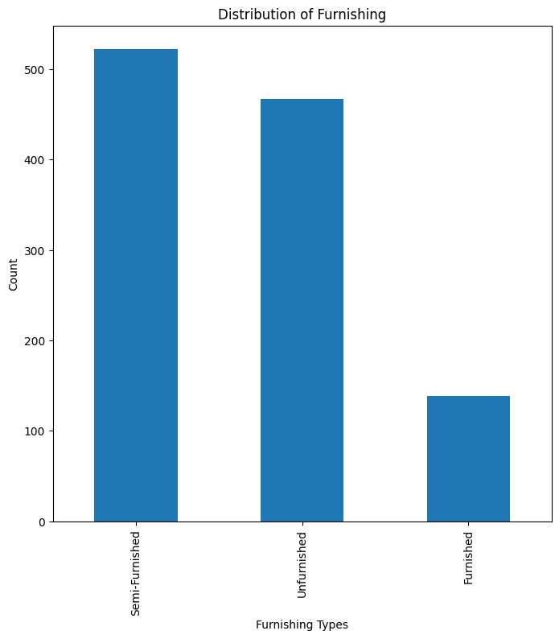

# House Listings Data Analysis

This project analyzes historical sales data of a real estate company, providing insights into property prices, types, amenities, and locations. The dataset encompasses various aspects of the housing market, facilitating informed decision-making in real estate investment, property management, and market strategies.

## Table of Contents
1. [Introduction](#introduction)
2. [Dataset Overview](#dataset-overview)
3. [Analysis](#analysis)
   - [Distribution of Property Prices](#question-1-distribution-of-property-prices)
   - [Most Popular Axis](#question-2-most-popular-axis)
   - [Relationship between Property Size and Price](#question-3-relationship-between-property-size-and-price)
   - [Most Common House Types](#question-4-most-common-house-types)
   - [Distribution of Furnishing](#question-5-distribution-of-furnishing)
   - [Distribution of Bedrooms](#question-6-distribution-of-bedrooms)
   - [Number of Properties with More Than 3 Bathrooms](#question-7-number-of-properties-with-more-than-3-bathrooms)
   - [Percentage of Properties Located Within an Estate](#question-8-percentage-of-properties-located-within-an-estate)
   - [Number of Properties with a Boys' Quarters (BQ)](#question-9-number-of-properties-with-a-boys-quarters-bq)
4. [Conclusion](#conclusion)

## Introduction 
This project aims to analyze historical sales data of a real estate company, focusing on house prices. The dataset includes sales records from various locations over a period of time. Predictive data analytics methods can be applied to this dataset for various insights into house pricing trends, factors influencing prices, and market dynamics.

## Dataset Overview 
The dataset used for analysis is stored in a CSV file named `house_listings.csv`. It contains the following columns:

- `price`: Price of the property
- `axis`: Location axis
- `Estate Name`: Name of the estate (if applicable)
- `Property Size`: Size of the property in square meters
- `Condition`: Condition of the property
- `Furnishing`: Furnishing status of the property
- `House_Type`: Type of house
- `Bedroom`: Number of bedrooms
- `Bathrooms`: Number of bathrooms
- `is_in_estate`: Binary indicator (1 if the property is within an estate, 0 otherwise)
- `has_BQ`: Binary indicator (1 if the property has a boys' quarters, 0 otherwise)

The dataset was scraped from [https://jiji.ng/lagos/houses-apartments-for-rent].

## Analysis 
### Distribution of Property Prices 

The majority of property prices fall between 30,000 and 18,000,000, with a peak around the 4,000,000 to 8,000,000 range. The distribution appears to be slightly right-skewed, indicating that there are relatively more properties with lower prices compared to higher prices.

### Most Popular Axis 

The axis with the highest number of properties listed is identified, which in this case is Lekki.

### Relationship between Property Size and Price 

This scatter plot visualizes the relationship between property size (in square meters) and price. It shows the distribution of property prices based on their sizes. There doesn't seem to be a strong relationship between property size and price, as the data points are scattered without a clear trend.

### Most Common House Types 

This bar chart illustrates the count of each type of house listed in the dataset. The most common house type is identified, which is the Duplex.

### Distribution of Furnishing 

This bar chart displays the distribution of different furnishing types among the listed properties. It shows the count of properties categorized by their furnishing status, such as Furnished, Semi Furnished, and Unfurnished.

### Distribution of Bedrooms 

This histogram depicts the distribution of the number of bedrooms among the listed properties. The average number of bedrooms is marked on the plot to provide a central measure.

### Number of Properties with More Than 3 Bathrooms 

This bar chart shows the count of properties that have more than 3 bathrooms.

### Percentage of Properties Located Within an Estate 

This pie chart visualizes the percentage of properties that are located within an estate versus those outside an estate.

### Number of Properties with a Boys' Quarters (BQ) 

This bar chart displays the count of properties that have a boys' quarters (BQ).

## Conclusion 
In conclusion, this analysis provides valuable insights into the house listings data, including property prices, types, amenities, and locations. Understanding these insights can help in making informed decisions related to real estate investments, property management, and market strategies.

